# 社区团购管理信息系统业务流程、数据流程与数据字典

## 1. 文档说明

本文档基于社区团购管理信息系统的前端页面、后端接口、业务服务和数据库表结构进行整理，重点分析系统业务流程、数据流程和数据字典。系统采用普通用户、商家、团长、系统管理员四类角色协同工作的业务模式，覆盖商品发布、商品审核、团购活动、下单支付、商家发货、自提核销、退款售后、通知公告和平台运营管理等业务。

## 2. 系统业务范围

### 2.1 角色与职责

| 角色 | 角色定位 | 主要职责 |
|---|---|---|
| 普通用户 | 社区团购消费者 | 注册登录、浏览商品、购物车管理、单买、拼团、免拼、支付、自提、退款、通知查看、个人资料维护 |
| 商家 | 商品供给方 | 商品新增、商品编辑、商品删除、库存价格维护、查看审核状态、查看订单、订单发货 |
| 团长 | 社区履约协同方 | 自提点维护、查看自提订单、确认到货、发送取件通知、取件码核销 |
| 系统管理员 | 平台运营管理方 | 用户状态管理、商品审核、拼团活动管理、订单查看、支付流水查看、退款审核、通知公告发布、运营数据查看 |

### 2.2 核心业务对象

| 业务对象 | 说明 |
|---|---|
| 用户账号 | 统一存储普通用户、商家、团长和管理员信息，通过角色字段区分身份 |
| 商品分类 | 商品浏览、筛选和归类的基础数据 |
| 商品 | 商家发布的可售商品，包含图片、价格、库存、销量和审核状态 |
| 拼团活动 | 管理员配置的团购规则，包含商品、拼团价、成团人数、活动时间和免拼规则 |
| 拼团实例 | 用户基于拼团活动发起的一次具体拼团 |
| 订单 | 用户购买商品形成的交易记录，记录商品快照、购买数量、支付、发货、自提和退款状态 |
| 支付流水 | 用户模拟支付后生成的支付记录 |
| 自提点 | 团长维护的社区取货地点 |
| 退款申请 | 用户对订单发起的售后退款记录 |
| 通知公告 | 系统公告、订单通知、拼团通知、取件通知和退款通知 |

## 3. 业务流程分析

### 3.1 用户与权限管理业务流程

#### 3.1.1 用户注册流程

1. 用户进入登录注册页面，切换到注册表单。
2. 用户填写用户名、密码、手机号、真实姓名、角色、社区、地址、头像地址、店铺名称和店铺地址等信息。
3. 前端提交注册数据到认证接口。
4. 后端检查用户名是否已存在。
5. 用户名未被占用时，系统写入用户表，默认账号状态为正常，默认免拼次数为 3 次。
6. 注册成功后，前端提示注册成功，并将用户名、密码和角色带回登录表单。

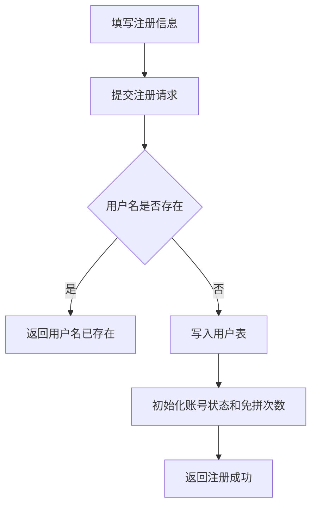

#### 3.1.2 用户登录与路由授权流程

1. 用户选择登录角色并输入用户名、密码。
2. 后端校验用户名、密码、角色一致性和账号状态。
3. 校验通过后生成 token，并返回用户 ID、用户名、角色、头像和角色首页路径。
4. 前端保存当前角色会话和全局会话。
5. 前端根据角色跳转到对应工作台。
6. 访问受保护路由时，前端检查路由角色与本地会话角色是否一致；不一致则跳转登录页。

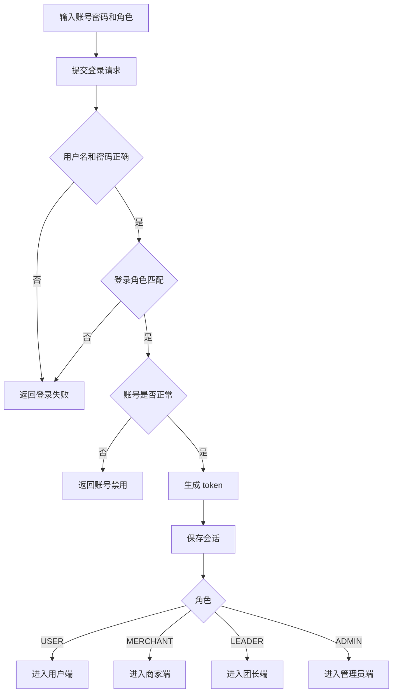

#### 3.1.3 管理员用户状态管理流程

1. 管理员进入用户管理页面。
2. 系统查询全部用户并展示角色、联系方式、社区、店铺和账号状态。
3. 管理员选择启用或禁用账号。
4. 后端更新用户状态字段。
5. 前端刷新用户列表并显示操作完成通知。

### 3.2 用户购买业务流程

#### 3.2.1 商品浏览与购物车流程

1. 用户登录后进入商品选购页面。
2. 系统加载商品分类、商品列表、拼团活动、自提点、用户订单、通知和个人资料。
3. 用户可按分类或关键词筛选商品。
4. 用户可将商品加入购物车；购物车数据存储在浏览器本地，以用户 ID 区分。
5. 用户可在购物车调整数量或移除商品，并从购物车进入结算。

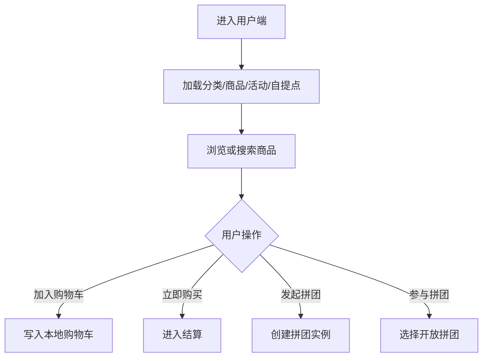

#### 3.2.2 单买下单与支付流程

1. 用户选择商品、数量和自提点。
2. 系统根据商品单买价生成订单，订单类型为 `SINGLE`。
3. 新订单初始状态为待支付，支付状态为未支付，发货状态为未发货，取件状态为未到货。
4. 用户输入支付密码并选择支付方式。
5. 后端校验支付密码，检查订单是否已支付，并扣减商品库存、增加销量。
6. 系统更新订单为待发货，写入支付流水，向用户写入支付成功通知。
7. 前端刷新订单列表。

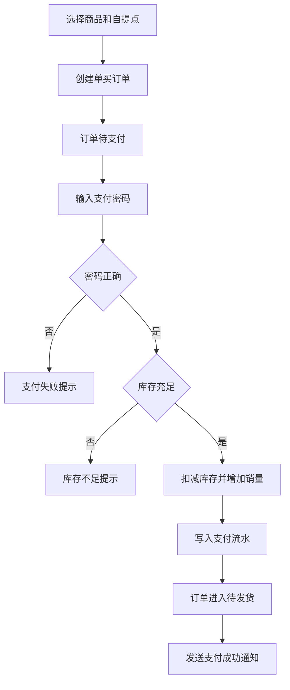

#### 3.2.3 拼团购买流程

拼团购买包含管理员配置活动、用户发起拼团、用户参与拼团、成团后支付和待发货处理。

1. 管理员创建拼团活动，设置商品、拼团价、成团人数、活动时间和免拼规则。
2. 用户在商品页发起拼团，系统创建拼团实例，初始人数为 0，状态为进行中。
3. 发起人或参与人创建拼团订单后，系统增加拼团当前人数。
4. 当前人数达到成团人数时，拼团实例状态变为成功。
5. 未支付拼团订单被激活为待支付，系统发送拼团已成团通知。
6. 用户支付拼团订单。若同一拼团下所有订单均已支付，系统将拼团订单更新为待发货。
7. 后续进入商家发货和团长自提核销流程。

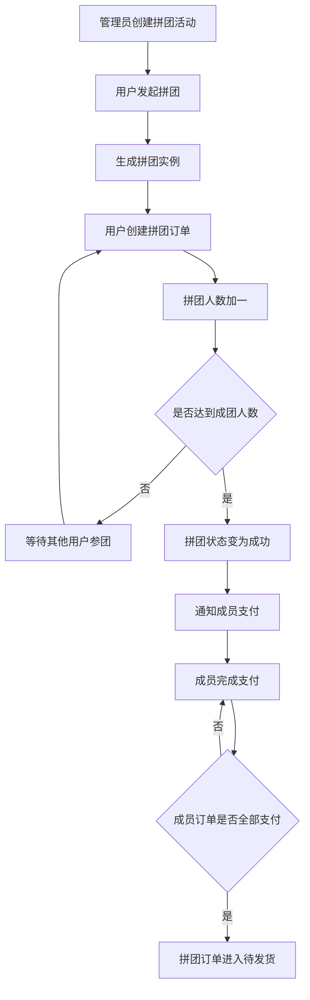

#### 3.2.4 免拼购买流程

1. 用户选择支持免拼的拼团商品。
2. 系统检查用户剩余免拼次数是否大于 0。
3. 后端检查商品是否存在有效拼团活动且允许免拼。
4. 系统扣减用户免拼次数。
5. 系统按拼团价创建免拼订单，订单类型为 `FREE_GROUP`。
6. 用户支付后订单进入待发货。

#### 3.2.5 拼团订单转免拼流程

1. 用户在我的拼团中选择未完成的拼团订单。
2. 系统检查订单是否属于当前用户、订单类型是否为拼团、状态是否允许转换。
3. 系统扣减用户免拼次数。
4. 订单类型由 `GROUP` 转为 `FREE_GROUP`，并解除拼团实例关联。
5. 原拼团实例当前人数减少。
6. 系统发送免拼成功通知。

### 3.3 商家售卖业务流程

#### 3.3.1 商品维护流程

1. 商家进入商家工作台。
2. 商家新增商品，填写分类、商品名称、描述、主图、详情图、原价、拼团价、单买价、库存和状态。
3. 系统写入商品表，审核状态默认为待审核。
4. 商家可编辑商品信息或删除商品。
5. 管理员审核通过后，商品状态变为上架；审核驳回时，商品状态变为下架。

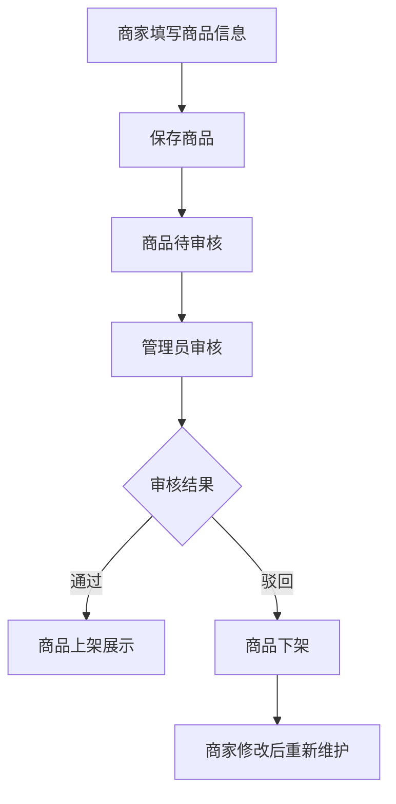

#### 3.3.2 商家订单发货流程

1. 商家进入订单管理页面。
2. 系统查询该商家的订单列表。
3. 商家筛选已支付且未发货订单。
4. 商家点击发货。
5. 后端将订单发货状态更新为已发货，订单主状态更新为运输中。
6. 系统向用户写入订单运输中通知。
7. 团长后续在自提点订单中处理到货和取件。

### 3.4 团长管理业务流程

#### 3.4.1 自提点维护流程

1. 团长进入团长工作台。
2. 系统加载团长名下自提点。
3. 团长可新增或编辑自提点名称、社区、地址、电话、营业时间和状态。
4. 后端保存自提点信息。
5. 用户下单时可选择启用状态的自提点。

#### 3.4.2 到货通知与取件码流程

1. 商家发货后，订单状态进入运输中。
2. 团长查看自提点关联订单。
3. 团长确认商品已到达自提点。
4. 若订单无取件码，系统生成 6 位取件码，并将订单取件状态更新为待取货，订单主状态更新为待自提。
5. 系统向用户发送取件通知，通知内容包含订单编号和取件码。
6. 用户在通知或待自提订单中查看取件信息。

#### 3.4.3 取件核销流程

1. 用户到达自提点并出示取件码。
2. 团长输入取件码。
3. 后端按取件码查找待取货订单。
4. 若取件码有效，系统更新取件状态为已取货，订单状态为已完成，并记录完成时间。
5. 若取件码无效或订单不可核销，系统返回错误提示。

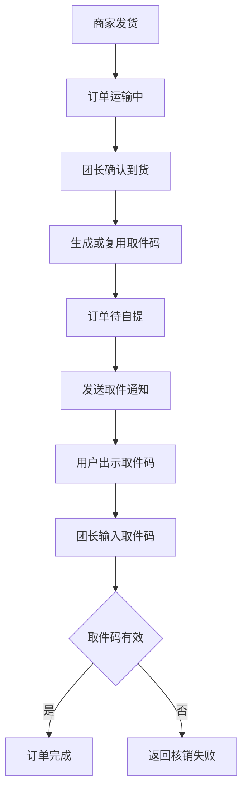

### 3.5 系统管理员业务流程

#### 3.5.1 平台运营总览流程

1. 管理员进入管理后台。
2. 系统并行加载用户、商品、订单、退款、拼团活动和支付流水。
3. 前端统计用户数、商家数、普通用户数、商品数、待处理退款数和交易额。
4. 管理员可查看最近订单、商品审核状态和平台主要运营数据。

#### 3.5.2 商品审核流程

1. 管理员查看商品列表。
2. 管理员对商品执行通过或驳回操作。
3. 审核通过时，商品审核状态为通过，商品状态为上架。
4. 审核驳回时，商品审核状态为驳回，商品状态为下架。
5. 商家可在商家端查看审核状态。

#### 3.5.3 拼团活动管理流程

1. 管理员选择商品创建拼团活动。
2. 管理员填写拼团价、成团人数、开始时间、结束时间、是否允许免拼和免拼次数。
3. 后端校验成团人数必须大于 0，并写入或更新拼团活动。
4. 用户端加载有效拼团活动并显示拼团入口。

#### 3.5.4 退款审核流程

1. 用户对订单提交退款申请。
2. 系统写入退款记录，并将订单状态更新为退款中。
3. 管理员查看退款申请。
4. 管理员审核通过时，退款状态变为已退款，订单状态变为已退货，支付状态变为已退款，并发送退款通过通知。
5. 管理员审核拒绝时，退款状态变为已拒绝，订单状态回到已支付状态，并发送退款拒绝通知。

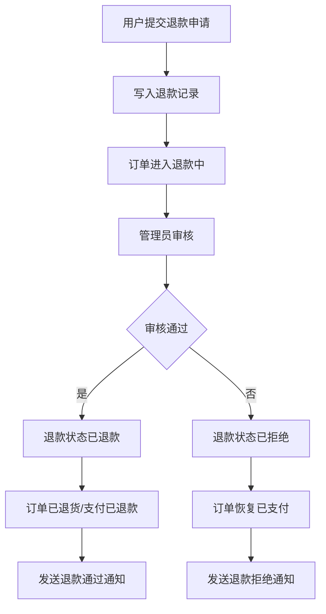

#### 3.5.5 通知公告发布流程

1. 管理员填写通知接收用户、标题、内容和通知类型。
2. 接收用户为空时，通知作为系统公告面向所有用户。
3. 接收用户不为空时，通知定向发送给指定用户。
4. 用户端通知页查询本人通知和系统公告。

### 3.6 其他补充业务流程

#### 3.6.1 支付流水管理流程

用户支付成功后，系统生成支付流水，记录订单、流水号、支付方式、支付金额、支付状态和支付时间。管理员可在支付流水页面查看全平台支付记录，用于交易追踪和对账分析。

#### 3.6.2 个人资料维护流程

普通用户可维护手机号、真实姓名、社区、地址和头像地址。系统更新用户表后刷新个人中心，头像地址同步到本地会话，用于页面头像展示。

#### 3.6.3 服务健康检查流程

登录页会调用健康检查接口，后端返回应用和数据库状态。该流程用于判断后端服务和数据库连接是否正常，辅助系统演示和运行诊断。

## 4. 数据流程分析

### 4.1 顶层数据流程图

顶层数据流程图从系统边界描述外部实体与社区团购管理信息系统之间的主要数据交换。

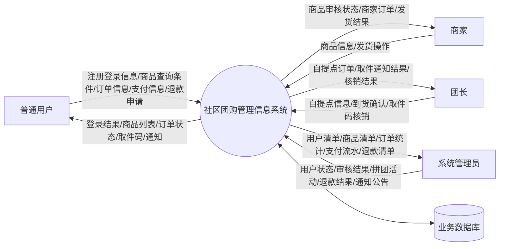

### 4.2 二层数据流程图

二层数据流程图将系统分解为认证用户管理、商品拼团管理、订单支付管理、履约自提管理、售后通知管理和系统运营管理六个处理过程。

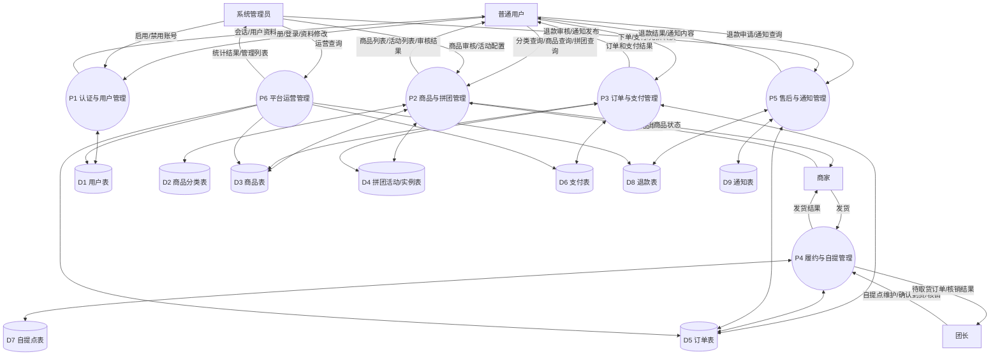

### 4.3 三层数据流程图

三层数据流程图进一步展开核心交易闭环，重点描述从商品选择到订单完成的数据流转。

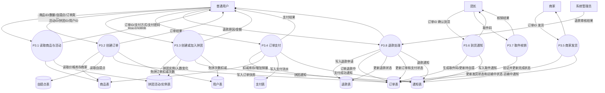

### 4.4 关键数据流说明

| 编号 | 数据流名称 | 来源 | 去向 | 主要内容 |
|---|---|---|---|---|
| F01 | 注册信息流 | 用户 | 认证与用户管理 | 用户名、密码、角色、手机号、姓名、社区、地址、店铺信息 |
| F02 | 登录认证流 | 用户 | 认证与用户管理 | 用户名、密码、角色 |
| F03 | 会话结果流 | 认证与用户管理 | 用户 | token、用户 ID、用户名、角色、头像、首页路径 |
| F04 | 商品查询流 | 用户 | 商品与拼团管理 | 分类 ID、关键词 |
| F05 | 商品维护流 | 商家 | 商品与拼团管理 | 商品分类、名称、描述、图片、价格、库存、状态 |
| F06 | 商品审核流 | 管理员 | 商品与拼团管理 | 商品 ID、审核状态 |
| F07 | 拼团活动配置流 | 管理员 | 商品与拼团管理 | 商品 ID、拼团价、成团人数、时间范围、免拼设置 |
| F08 | 拼团参与流 | 用户 | 商品与拼团管理 | 活动 ID、拼团 ID、用户 ID |
| F09 | 下单数据流 | 用户 | 订单与支付管理 | 用户 ID、商品 ID、数量、订单类型、拼团 ID、自提点 ID |
| F10 | 支付数据流 | 用户 | 订单与支付管理 | 订单 ID、支付方式、支付密码 |
| F11 | 发货数据流 | 商家 | 履约与自提管理 | 订单 ID |
| F12 | 到货通知流 | 团长 | 履约与自提管理 | 订单 ID、取件码、通知内容 |
| F13 | 核销数据流 | 团长 | 履约与自提管理 | 取件码 |
| F14 | 退款申请流 | 用户 | 售后与通知管理 | 订单 ID、用户 ID、退款原因、退款金额 |
| F15 | 退款审核流 | 管理员 | 售后与通知管理 | 退款 ID、管理员 ID、审核状态 |
| F16 | 通知公告流 | 管理员/系统 | 通知存储/用户 | 接收用户、标题、内容、通知类型 |
| F17 | 运营查询流 | 管理员 | 平台运营管理 | 用户、商品、订单、支付、退款和活动查询请求 |

## 5. 数据字典

### 5.1 数据项字典

#### 5.1.1 用户与权限数据项

| 数据项 | 字段名 | 类型 | 说明 |
|---|---|---|---|
| 用户ID | `user_id` | BIGINT | 用户唯一标识 |
| 用户名 | `username` | VARCHAR(50) | 登录账号，唯一 |
| 密码 | `password` | VARCHAR(255) | 登录密码，当前为演示明文 |
| 手机号 | `phone` | VARCHAR(20) | 用户联系电话 |
| 真实姓名 | `real_name` | VARCHAR(50) | 用户真实姓名 |
| 角色 | `role` | VARCHAR(20) | `USER`、`LEADER`、`MERCHANT`、`ADMIN` |
| 所属社区 | `community_name` | VARCHAR(100) | 用户所在社区 |
| 地址 | `address` | VARCHAR(255) | 用户住址或联系地址 |
| 头像地址 | `avatar_url` | VARCHAR(255) | 头像图片 URL |
| 店铺名称 | `shop_name` | VARCHAR(100) | 商家店铺名称 |
| 店铺地址 | `shop_address` | VARCHAR(255) | 商家店铺地址 |
| 账号状态 | `status` | TINYINT | 0 禁用，1 正常 |
| 免拼次数 | `free_group_count` | INT | 用户剩余免拼次数 |
| 创建时间 | `create_time` | DATETIME | 用户创建时间 |

#### 5.1.2 商品与分类数据项

| 数据项 | 字段名 | 类型 | 说明 |
|---|---|---|---|
| 分类ID | `category_id` | BIGINT | 分类唯一标识 |
| 分类名称 | `category_name` | VARCHAR(100) | 商品分类名称 |
| 父级分类ID | `parent_id` | BIGINT | 上级分类，顶级分类为 0 |
| 分类排序 | `sort` | INT | 分类显示顺序 |
| 分类状态 | `status` | TINYINT | 分类启用状态 |
| 商品ID | `product_id` | BIGINT | 商品唯一标识 |
| 商家ID | `merchant_id` | BIGINT | 发布商品的商家用户 ID |
| 商品名称 | `product_name` | VARCHAR(100) | 商品标题 |
| 商品描述 | `description` | TEXT | 商品说明 |
| 主图 | `main_image` | VARCHAR(255) | 商品主图 URL |
| 详情图 | `detail_images` | TEXT | 商品详情图片 |
| 原价 | `original_price` | DECIMAL(10,2) | 商品原价 |
| 拼团价 | `group_price` | DECIMAL(10,2) | 商品默认拼团价 |
| 单买价 | `single_price` | DECIMAL(10,2) | 商品单独购买价格 |
| 库存 | `stock` | INT | 可售库存 |
| 销量 | `sales_count` | INT | 已销售数量 |
| 商品状态 | `status` | TINYINT | 0 下架，1 上架 |
| 审核状态 | `audit_status` | TINYINT | 0 待审，1 通过，2 驳回 |

#### 5.1.3 拼团数据项

| 数据项 | 字段名 | 类型 | 说明 |
|---|---|---|---|
| 活动ID | `activity_id` | BIGINT | 拼团活动唯一标识 |
| 活动商品ID | `product_id` | BIGINT | 参与拼团的商品 |
| 活动拼团价 | `group_price` | DECIMAL(10,2) | 活动价格 |
| 成团人数 | `group_size` | INT | 达成拼团所需人数 |
| 开始时间 | `start_time` | DATETIME | 活动开始时间 |
| 结束时间 | `end_time` | DATETIME | 活动结束时间 |
| 是否允许免拼 | `allow_free_group` | TINYINT | 0 不允许，1 允许 |
| 免拼次数设置 | `free_group_limit` | INT | 活动免拼规则参数 |
| 活动状态 | `status` | TINYINT | 活动启用状态 |
| 拼团ID | `group_id` | BIGINT | 拼团实例唯一标识 |
| 开团用户ID | `leader_user_id` | BIGINT | 发起拼团的用户 |
| 当前人数 | `current_count` | INT | 当前参与人数 |
| 要求人数 | `required_count` | INT | 成团目标人数 |
| 拼团状态 | `status` | TINYINT | 0 进行中，1 成功，2 失败 |
| 过期时间 | `expire_time` | DATETIME | 拼团实例截止时间 |

#### 5.1.4 订单、支付、履约数据项

| 数据项 | 字段名 | 类型 | 说明 |
|---|---|---|---|
| 订单ID | `order_id` | BIGINT | 订单唯一标识 |
| 订单编号 | `order_no` | VARCHAR(50) | 业务订单号，唯一 |
| 下单用户ID | `user_id` | BIGINT | 下单用户 |
| 订单商家ID | `merchant_id` | BIGINT | 订单所属商家 |
| 订单商品ID | `product_id` | BIGINT | 购买商品 |
| 商品快照名称 | `product_name` | VARCHAR(100) | 下单时商品名称 |
| 下单价格 | `product_price` | DECIMAL(10,2) | 下单时商品单价 |
| 购买数量 | `quantity` | INT | 购买件数 |
| 订单金额 | `total_amount` | DECIMAL(10,2) | 单价乘数量 |
| 关联拼团ID | `group_id` | BIGINT | 拼团订单关联的拼团实例 |
| 订单类型 | `order_type` | VARCHAR(20) | `SINGLE`、`GROUP`、`FREE_GROUP` |
| 自提点ID | `pickup_point_id` | BIGINT | 用户选择的自提点 |
| 取件码 | `pickup_code` | VARCHAR(20) | 团长确认到货后生成 |
| 取件状态 | `pickup_status` | TINYINT | 0 未到货，1 待取货，2 已取货 |
| 订单状态 | `order_status` | TINYINT | 0 待支付，1 已支付，2 拼团中，3 待发货，4 运输中，5 待自提，6 已完成，7 已取消，8 退款中，9 已退货 |
| 支付状态 | `pay_status` | TINYINT | 0 未支付，1 已支付，3 已退款 |
| 发货状态 | `delivery_status` | TINYINT | 0 未发货，1 已发货 |
| 支付时间 | `pay_time` | DATETIME | 订单支付时间 |
| 完成时间 | `finish_time` | DATETIME | 订单核销完成时间 |
| 支付ID | `payment_id` | BIGINT | 支付流水唯一标识 |
| 支付流水号 | `pay_no` | VARCHAR(100) | 支付业务流水号 |
| 支付方式 | `pay_method` | VARCHAR(50) | 微信支付、支付宝支付、银行卡支付或模拟支付 |
| 支付金额 | `pay_amount` | DECIMAL(10,2) | 实际支付金额 |

#### 5.1.5 自提、退款、通知数据项

| 数据项 | 字段名 | 类型 | 说明 |
|---|---|---|---|
| 自提点ID | `pickup_point_id` | BIGINT | 自提点唯一标识 |
| 团长ID | `leader_id` | BIGINT | 管理自提点的团长 |
| 自提点名称 | `point_name` | VARCHAR(100) | 自提点名称 |
| 自提点地址 | `address` | VARCHAR(255) | 自提点详细地址 |
| 自提点电话 | `phone` | VARCHAR(20) | 自提点联系电话 |
| 营业时间 | `business_hours` | VARCHAR(100) | 自提点可取货时间 |
| 退款ID | `refund_id` | BIGINT | 退款申请唯一标识 |
| 退款原因 | `refund_reason` | VARCHAR(255) | 用户填写的退款原因 |
| 退款金额 | `refund_amount` | DECIMAL(10,2) | 申请退款金额 |
| 退款状态 | `refund_status` | TINYINT | 0 待审核，2 已拒绝，3 已退款 |
| 处理管理员ID | `admin_id` | BIGINT | 处理退款的管理员 |
| 申请时间 | `apply_time` | DATETIME | 退款申请时间 |
| 处理时间 | `handle_time` | DATETIME | 管理员处理时间 |
| 通知ID | `notice_id` | BIGINT | 通知唯一标识 |
| 接收用户ID | `user_id` | BIGINT | 为空表示系统公告 |
| 通知标题 | `title` | VARCHAR(100) | 通知标题 |
| 通知内容 | `content` | TEXT | 通知正文 |
| 通知类型 | `notice_type` | VARCHAR(50) | `SYSTEM`、`ORDER`、`GROUP`、`PICKUP`、`REFUND` |
| 阅读状态 | `read_status` | TINYINT | 0 未读，1 已读 |

#### 5.1.6 数据表字段完整性清单

| 数据表 | 完整字段 |
|---|---|
| `user` | `user_id`、`username`、`password`、`phone`、`real_name`、`role`、`community_name`、`address`、`avatar_url`、`shop_name`、`shop_address`、`status`、`create_time`、`free_group_count` |
| `category` | `category_id`、`category_name`、`parent_id`、`sort`、`status` |
| `product` | `product_id`、`merchant_id`、`category_id`、`product_name`、`description`、`main_image`、`detail_images`、`original_price`、`group_price`、`single_price`、`stock`、`sales_count`、`status`、`audit_status`、`create_time` |
| `group_activity` | `activity_id`、`product_id`、`group_price`、`group_size`、`start_time`、`end_time`、`allow_free_group`、`free_group_limit`、`status`、`create_time` |
| `group_instance` | `group_id`、`activity_id`、`leader_user_id`、`current_count`、`required_count`、`status`、`expire_time`、`create_time` |
| `pickup_point` | `pickup_point_id`、`leader_id`、`point_name`、`community_name`、`address`、`phone`、`business_hours`、`status` |
| `orders` | `order_id`、`order_no`、`user_id`、`merchant_id`、`product_id`、`product_name`、`product_price`、`quantity`、`total_amount`、`group_id`、`order_type`、`pickup_point_id`、`pickup_code`、`pickup_status`、`order_status`、`pay_status`、`delivery_status`、`create_time`、`pay_time`、`finish_time` |
| `payment` | `payment_id`、`order_id`、`pay_no`、`pay_method`、`pay_amount`、`pay_status`、`pay_time` |
| `refund` | `refund_id`、`order_id`、`user_id`、`refund_reason`、`refund_amount`、`refund_status`、`admin_id`、`apply_time`、`handle_time` |
| `notice` | `notice_id`、`user_id`、`title`、`content`、`notice_type`、`read_status`、`create_time` |

### 5.2 数据结构字典

| 数据结构 | 组成数据项 | 说明 |
|---|---|---|
| 登录请求 | 用户名、密码、角色 | 用户登录认证所需数据 |
| 登录结果 | 用户ID、用户名、角色、头像、token、首页路径 | 登录成功后返回给前端的会话数据 |
| 注册信息 | 用户名、密码、手机号、真实姓名、角色、社区、地址、头像、店铺名称、店铺地址 | 新用户创建账号的数据结构 |
| 商品信息 | 商品ID、商家ID、分类ID、名称、描述、图片、原价、拼团价、单买价、库存、状态、审核状态 | 商家维护和用户浏览的商品数据 |
| 商品展示信息 | 商品信息、商家名称、商家头像、分类名称 | 商品列表和详情页展示数据 |
| 拼团活动信息 | 活动ID、商品ID、拼团价、成团人数、开始时间、结束时间、免拼设置、状态 | 管理员配置的拼团规则 |
| 拼团实例信息 | 拼团ID、活动ID、开团用户、当前人数、要求人数、状态、过期时间 | 用户发起的一次具体拼团 |
| 下单请求 | 用户ID、商品ID、数量、订单类型、拼团ID、自提点ID | 创建订单时提交的数据 |
| 订单信息 | 订单ID、订单编号、用户、商家、商品快照、数量、金额、订单类型、拼团ID、自提点、取件码、各类状态、时间 | 交易全过程的核心数据结构 |
| 支付请求 | 订单ID、支付方式、支付密码 | 模拟支付提交的数据 |
| 支付流水 | 支付ID、订单ID、支付流水号、支付方式、支付金额、支付状态、支付时间 | 管理员查询和交易追踪的数据 |
| 自提点信息 | 自提点ID、团长ID、名称、社区、地址、电话、营业时间、状态 | 用户选择自提点和团长维护自提点的数据 |
| 退款申请 | 退款ID、订单ID、用户ID、原因、金额、状态、管理员ID、申请时间、处理时间 | 售后退款处理的数据结构 |
| 通知信息 | 通知ID、接收用户、标题、内容、类型、阅读状态、创建时间 | 用户通知和系统公告的数据结构 |

### 5.3 数据流字典

| 数据流 | 输入数据 | 输出数据 | 相关处理 |
|---|---|---|---|
| 注册数据流 | 注册信息 | 用户资料 | 用户注册处理 |
| 登录数据流 | 登录请求 | 登录结果 | 登录认证处理 |
| 用户状态变更流 | 用户ID、状态值 | 操作结果 | 管理员用户状态管理 |
| 商品查询流 | 分类ID、关键词 | 商品展示信息列表 | 商品浏览处理 |
| 商品维护流 | 商品信息 | 商品展示信息 | 商家商品新增或编辑处理 |
| 商品审核流 | 商品ID、审核状态 | 审核结果 | 管理员商品审核处理 |
| 拼团活动流 | 拼团活动信息 | 活动信息 | 拼团活动保存处理 |
| 开团数据流 | 活动ID、用户ID | 拼团实例信息 | 发起拼团处理 |
| 参团数据流 | 拼团ID、用户ID | 拼团实例信息 | 参与拼团处理 |
| 下单数据流 | 下单请求 | 订单信息 | 创建订单处理 |
| 支付数据流 | 支付请求 | 订单信息、支付流水、通知 | 支付处理 |
| 发货数据流 | 订单ID | 操作结果、通知 | 商家发货处理 |
| 到货通知流 | 订单ID | 取件码、通知 | 团长确认到货处理 |
| 取件核销流 | 取件码 | 核销结果 | 团长核销处理 |
| 退款申请流 | 订单ID、用户ID、原因、金额 | 退款记录 | 用户退款申请处理 |
| 退款审核流 | 退款ID、管理员ID、审核状态 | 退款结果、通知 | 管理员退款处理 |
| 通知查询流 | 用户ID | 通知列表 | 用户通知查看处理 |
| 运营查询流 | 管理员查询请求 | 用户、商品、订单、支付、退款、活动数据 | 管理员运营查询处理 |

### 5.4 数据存储字典

| 编号 | 数据存储 | 数据表 | 主键 | 主要内容 | 主要使用者 |
|---|---|---|---|---|---|
| D1 | 用户存储 | `user` | `user_id` | 用户账号、角色、联系方式、社区、店铺、状态、免拼次数 | 用户、管理员、订单、拼团 |
| D2 | 分类存储 | `category` | `category_id` | 商品分类名称、父级、排序、状态 | 用户、商家、管理员 |
| D3 | 商品存储 | `product` | `product_id` | 商品、价格、库存、销量、商家、审核状态 | 用户、商家、管理员、订单 |
| D4 | 拼团活动存储 | `group_activity` | `activity_id` | 拼团规则、活动时间、免拼设置 | 管理员、用户 |
| D5 | 拼团实例存储 | `group_instance` | `group_id` | 发起用户、当前人数、目标人数、拼团状态 | 用户、订单 |
| D6 | 订单存储 | `orders` | `order_id` | 商品快照、金额、拼团、自提、支付、发货、核销状态 | 用户、商家、团长、管理员 |
| D7 | 支付存储 | `payment` | `payment_id` | 支付流水、支付方式、支付金额和时间 | 用户、管理员 |
| D8 | 自提点存储 | `pickup_point` | `pickup_point_id` | 团长、自提点名称、地址、电话、营业时间 | 用户、团长 |
| D9 | 退款存储 | `refund` | `refund_id` | 退款申请、金额、状态、处理管理员 | 用户、管理员 |
| D10 | 通知存储 | `notice` | `notice_id` | 系统公告、订单通知、拼团通知、取件通知、退款通知 | 用户、管理员、系统处理逻辑 |

### 5.5 处理逻辑字典

| 编号 | 处理逻辑 | 输入 | 处理规则 | 输出 |
|---|---|---|---|---|
| P1 | 用户注册 | 注册信息 | 检查用户名唯一；角色为空时默认为普通用户；写入用户表 | 用户资料 |
| P2 | 用户登录 | 用户名、密码、角色 | 校验账号、密码、角色和状态；生成 token | 登录结果 |
| P3 | 路由授权 | token、角色 | 前端检查访问路由的角色与会话角色是否一致 | 允许访问或跳转登录 |
| P4 | 用户状态管理 | 用户ID、状态 | 管理员更新用户状态 | 操作结果 |
| P5 | 商品维护 | 商品信息 | 新增商品审核状态为待审；编辑更新商品基础信息；删除商品记录 | 商品结果 |
| P6 | 商品审核 | 商品ID、审核状态 | 通过时上架；驳回时下架 | 审核结果 |
| P7 | 拼团活动保存 | 活动信息 | 校验成团人数大于 0；设置默认状态和免拼参数；新增或更新活动 | 活动信息 |
| P8 | 发起拼团 | 活动ID、用户ID | 检查活动存在；设置过期时间；创建拼团实例 | 拼团实例 |
| P9 | 参与拼团 | 拼团ID、用户ID | 检查不能参与自己的拼团、拼团未结束且未过期；增加人数；满员则成功 | 拼团实例 |
| P10 | 创建订单 | 下单请求 | 读取商品价格；按订单类型确定价格；免拼时扣减次数；写入订单快照 | 订单信息 |
| P11 | 支付订单 | 订单ID、支付方式、支付密码 | 校验密码、重复支付和库存；扣库存；更新支付状态；写入支付流水和通知 | 支付结果 |
| P12 | 拼团成团处理 | 拼团ID | 拼团满员后激活支付；所有成员支付后进入待发货 | 拼团订单状态 |
| P13 | 免拼转换 | 订单ID、用户ID | 校验订单归属和状态；扣减免拼次数；订单转免拼；拼团人数减少 | 订单信息 |
| P14 | 商家发货 | 订单ID | 已支付订单更新为运输中和已发货；写入运输中通知 | 发货结果 |
| P15 | 到货通知 | 订单ID | 商品到达后生成取件码；订单变为待自提；写入取件通知 | 取件通知 |
| P16 | 取件核销 | 取件码 | 查找待取货订单；更新为已完成并记录完成时间 | 核销结果 |
| P17 | 退款申请 | 订单ID、用户ID、原因、金额 | 写入退款表；订单状态更新为退款中 | 退款记录 |
| P18 | 退款审核 | 退款ID、管理员ID、状态 | 通过则退款已处理且支付已退款；拒绝则订单恢复已支付；写入通知 | 退款结果 |
| P19 | 通知发布 | 用户ID、标题、内容、类型 | 用户为空则系统公告；否则定向通知 | 通知记录 |
| P20 | 运营统计 | 管理员查询请求 | 查询用户、商品、订单、支付、退款、活动并前端汇总 | 运营数据 |

### 5.6 外部实体字典

| 外部实体 | 输入系统的数据 | 从系统获得的数据 |
|---|---|---|
| 普通用户 | 注册信息、登录信息、商品查询条件、下单信息、支付信息、退款申请、个人资料 | 登录结果、商品列表、拼团列表、订单状态、支付结果、取件码、退款结果、通知公告 |
| 商家 | 登录信息、商品信息、发货操作 | 商品列表、审核状态、商家订单、发货结果 |
| 团长 | 登录信息、自提点信息、到货确认、取件码 | 自提点列表、自提点订单、取件通知结果、核销结果 |
| 系统管理员 | 登录信息、用户状态、审核结果、拼团活动、退款处理结果、通知公告 | 用户清单、商品清单、订单列表、支付流水、退款申请、运营统计 |
| 数据库系统 | 查询和更新请求 | 用户、商品、拼团、订单、支付、退款、通知等持久化数据 |

## 6. 状态转换汇总

### 6.1 订单状态

| 状态值 | 状态名称 | 产生场景 |
|---|---|---|
| 0 | 待支付 | 单买、免拼或已成团拼团订单等待支付 |
| 1 | 已支付 | 退款拒绝后订单恢复状态；前端状态映射保留 |
| 2 | 拼团中 | 拼团订单创建后等待成团 |
| 3 | 待发货 | 单买、免拼支付成功，或拼团全部成员支付完成 |
| 4 | 运输中 | 商家发货后 |
| 5 | 待自提 | 团长确认到货并发送取件通知后 |
| 6 | 已完成 | 团长核销取件码后 |
| 7 | 已取消 | 预留状态，部分查询会排除该状态 |
| 8 | 退款中 | 用户提交退款申请后 |
| 9 | 已退货 | 管理员通过退款后 |

### 6.2 其他状态

| 字段 | 状态值 | 说明 |
|---|---|---|
| `user.status` | 0/1 | 禁用/正常 |
| `product.status` | 0/1 | 下架/上架 |
| `product.audit_status` | 0/1/2 | 待审/通过/驳回 |
| `group_instance.status` | 0/1/2 | 进行中/成功/失败 |
| `orders.pay_status` | 0/1/3 | 未支付/已支付/已退款 |
| `orders.delivery_status` | 0/1 | 未发货/已发货 |
| `orders.pickup_status` | 0/1/2 | 未到货/待取货/已取货 |
| `refund.refund_status` | 0/2/3 | 待审核/已拒绝/已退款 |
| `notice.read_status` | 0/1 | 未读/已读 |

## 7. 总结

社区团购管理信息系统围绕四类角色形成了较完整的业务闭环。普通用户负责消费侧操作，商家负责商品供给和发货，团长负责社区末端履约，系统管理员负责平台运营和审核监管。系统的数据流以订单为核心，连接商品、拼团、支付、自提、退款和通知等数据存储，能够支撑从商品发布到订单完成、从售后申请到通知反馈的全过程管理。

从数据字典看，系统核心数据结构清晰，状态字段覆盖交易全生命周期。当前系统适合作为课程设计和社区团购业务原型，后续可在后端接口级权限控制、密码加密、分页统计、自动取消订单、拼团失败自动退款和操作日志方面继续增强。
