# 社区团购管理信息系统分析与设计报告

## 1. 项目概述

### 1.1 系统名称

社区团购管理信息系统。

### 1.2 系统定位

本系统是一个面向社区团购场景的前后端分离管理信息系统，围绕“社区居民在线选购、多人拼团、商家发货、团长自提核销、管理员统一运营”的业务闭环进行设计和实现。系统既覆盖普通客户的购物体验，也覆盖商家、团长和管理员的业务管理需求。

### 1.3 建设背景

社区团购业务具有用户集中、商品高频、履约点固定、订单批量化等特点。传统手工统计方式容易出现商品归属不清、订单状态混乱、拼团人数难以追踪、取件核销效率低、售后处理不透明等问题。因此需要建设一个信息化平台，将商品、订单、拼团、自提、支付、通知和售后统一管理。

### 1.4 系统使命

系统使命是用信息化手段提升社区团购业务的组织效率，使客户、商家、团长和平台管理员能够在同一系统中完成协同工作。

具体包括：

- 为客户提供清晰的商品选购、拼团下单、支付、自提和售后流程。
- 为商家提供商品上架、价格库存维护和订单发货能力。
- 为团长提供自提点维护、到货通知、取件码核销能力。
- 为管理员提供用户管理、商品审核、拼团活动、订单、支付、退款和公告管理能力。
- 通过统一数据库记录业务全过程，保证业务状态可追踪、可查询、可统计。

### 1.5 设计目标

| 目标类别 | 目标说明 |
|---|---|
| 业务完整性 | 覆盖客户购物、拼团、支付、发货、自提、退款、通知等核心流程 |
| 角色清晰性 | 普通客户、商家、团长、管理员四类角色职责分离 |
| 数据一致性 | 商品、订单、拼团、支付、退款等数据通过外键或业务字段关联 |
| 易用性 | 前端页面按角色进入不同工作台，界面直观，操作路径短 |
| 可扩展性 | 后端采用 Controller、Service、Mapper 分层结构，便于后续扩展 |
| 可维护性 | 数据表数量精简，核心业务字段集中，适合课程设计和中小型系统实现 |
| 可演示性 | 内置演示用户、商品、商家、拼团活动和自提点数据，方便系统展示 |

## 2. 需求分析

### 2.1 用户角色分析

系统包含四类核心角色。

| 角色 | 主要职责 | 典型操作 |
|---|---|---|
| 普通客户 | 购买商品、参与拼团、自提取货、申请退款 | 浏览商品、加入购物车、发起拼团、参团、支付、查看取件码 |
| 商家 | 维护商品与处理订单发货 | 新增商品、编辑图片价格库存、查看订单、发货 |
| 团长 | 管理社区自提点与订单核销 | 维护自提点、确认到货、发送取件通知、核销取件码 |
| 管理员 | 维护平台整体运营 | 用户管理、商品审核、拼团活动、订单管理、退款审核、发布公告 |

### 2.2 功能性需求

#### 2.2.1 登录注册

- 支持统一登录入口。
- 支持按角色登录，并校验用户真实角色。
- 支持用户注册，并录入手机号、真实姓名、社区、地址、头像、店铺信息等。
- 登录成功后根据角色跳转到对应页面。

#### 2.2.2 普通客户功能

- 浏览商品列表和商品分类。
- 搜索商品。
- 查看商品图片、价格、库存、销量、商家名称和商家头像。
- 发起拼团、参与拼团、免拼购买、单独购买。
- 购物车管理。
- 创建订单、选择自提点、模拟支付。
- 查看待支付、待自提、全部订单。
- 查看拼团成员头像、当前人数和成团人数。
- 维护个人资料和头像。
- 申请退款、查看通知。

#### 2.2.3 商家功能

- 查看经营概览。
- 查看自己上架的商品信息，包括图片、单价、拼团价、库存、审核状态。
- 新增、编辑、删除商品。
- 查看购买本商家商品的订单。
- 对已支付订单执行发货操作。

#### 2.2.4 团长功能

- 查看团长工作台运营概览。
- 维护自提点名称、社区、地址、电话和营业时间。
- 查看运输中、待取货、已完成订单。
- 查看客户头像、订单号、商品和取件码。
- 确认到货并发送取件通知。
- 输入取件码核销订单。

#### 2.2.5 管理员功能

- 查看用户总数、普通客户数、商家数、商品数、交易额等平台指标。
- 管理用户启用/禁用。
- 查看用户头像、角色、电话、社区、店铺信息。
- 审核商家发布的商品。
- 创建拼团活动，设置拼团价、成团人数、活动时间和免拼规则。
- 查看平台全部订单。
- 查看支付流水。
- 审核退款申请。
- 发布系统公告或定向通知。

### 2.3 非功能性需求

| 需求类别 | 说明 |
|---|---|
| 性能需求 | 课程设计和中小规模演示场景下，普通列表查询应快速响应 |
| 可用性需求 | 前端提供统一入口，不同角色进入不同工作台，降低学习成本 |
| 可靠性需求 | 订单状态、支付状态、发货状态、取件状态分字段记录，避免状态混乱 |
| 安全性需求 | 登录后保存 token，前端路由按角色拦截；后续可继续增强后端 JWT 拦截 |
| 可维护性需求 | 后端分层清晰，前端视图按角色分目录管理 |
| 数据可追溯 | 支付、退款、通知、订单均有独立记录，可追踪业务过程 |

## 3. 系统总体架构设计

### 3.1 总体架构

系统采用前后端分离架构。

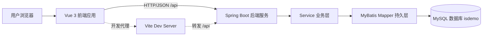

### 3.2 分层架构

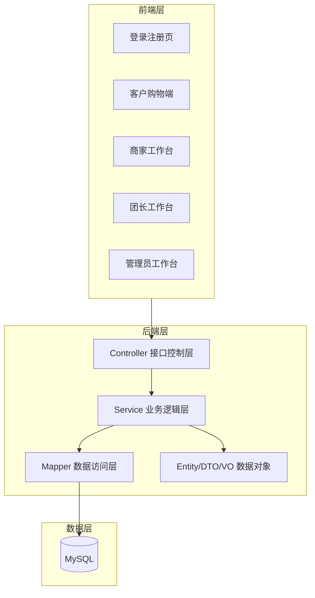

### 3.3 技术栈

#### 前端技术栈

| 技术 | 版本/来源 | 用途 |
|---|---|---|
| Vue | 3.5.34 | 构建单页应用和组件化界面 |
| Vue Router | 5.0.7 | 前端路由和角色页面跳转 |
| Element Plus | 2.14.0 | 表单、表格、按钮、弹窗、标签、头像等 UI 组件 |
| Axios | 1.16.1 | 与后端 REST API 通信 |
| Vite | 8.0.12 | 前端开发服务器、构建工具和代理配置 |
| CSS | 原生 CSS | 页面布局、工作台美化、响应式适配 |

#### 后端技术栈

| 技术 | 版本/来源 | 用途 |
|---|---|---|
| Java | 17+ | 后端开发语言 |
| Spring Boot | 4.0.6 | 后端 Web 应用框架 |
| Spring Web MVC | Spring Boot Starter | REST API 控制器 |
| MyBatis Spring Boot Starter | 4.0.1 | 数据库访问与 SQL 映射 |
| MySQL Connector/J | 运行时依赖 | 连接 MySQL 数据库 |
| Lombok | 编译期工具 | 简化实体类 getter/setter |
| Maven | 项目构建工具 | 依赖管理、测试和打包 |
| JWT 工具类 | 项目内实现 | 登录 token 生成 |

#### 数据库与运行环境

| 技术 | 用途 |
|---|---|
| MySQL 8 | 存储用户、商品、订单、支付、退款、通知等业务数据 |
| utf8mb4 | 支持中文和头像链接等字符数据 |
| Vite Proxy | 开发环境中将 `/api` 转发到后端 |
| RESTful API | 前后端统一交互风格 |

## 4. 系统功能结构设计

### 4.1 功能模块结构图

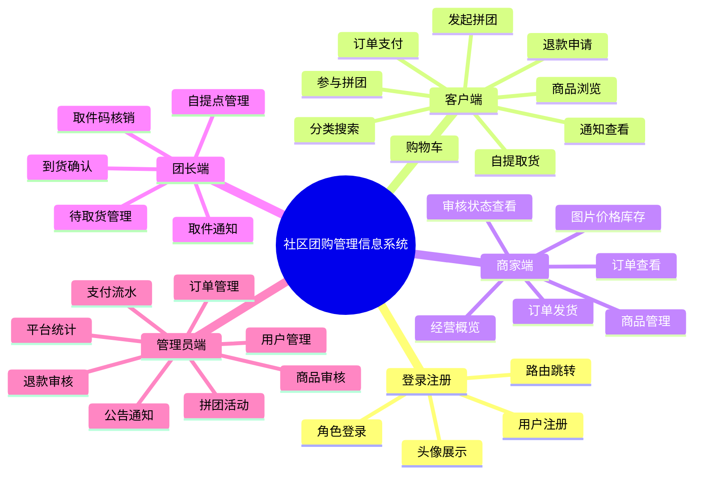

### 4.2 前端页面结构

| 页面文件 | 对应角色 | 功能说明 |
|---|---|---|
| `src/views/login/LoginView.vue` | 所有用户 | QQ 风格登录注册页，支持头像展示、角色选择、服务状态检查 |
| `src/views/user/UserHome.vue` | 普通客户 | 商品选购、购物车、拼团、订单、支付、退款、个人中心 |
| `src/views/merchant/MerchantHome.vue` | 商家 | 商品管理、经营概览、订单发货 |
| `src/views/leader/LeaderHome.vue` | 团长 | 自提点管理、到货通知、订单核销 |
| `src/views/admin/AdminHome.vue` | 管理员 | 用户、商品、拼团、订单、支付、退款、公告管理 |

### 4.3 后端模块结构

| 包/层 | 说明 |
|---|---|
| `controller` | 接收 HTTP 请求，返回统一 `Result` |
| `service` | 定义业务接口 |
| `service.impl` | 实现业务逻辑，如登录、下单、支付、发货、核销、退款 |
| `mapper` | MyBatis SQL 映射，执行数据库查询和更新 |
| `entity` | 数据库实体对象 |
| `dto` | 前端提交参数对象 |
| `vo` | 返回给前端展示的视图对象 |
| `common` | 统一响应、状态码、异常处理 |
| `config` | 跨域配置 |
| `utils` | JWT 工具类 |

## 5. 数据流程图

### 5.1 顶层数据流程图

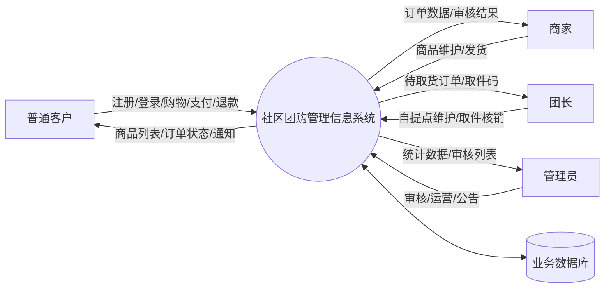

### 5.2 业务数据流程图

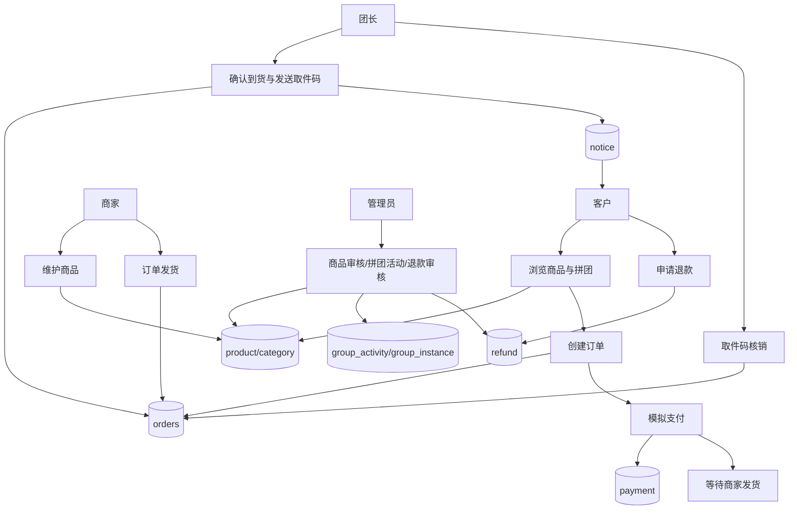

## 6. 业务流程设计

### 6.1 商品上架与审核流程

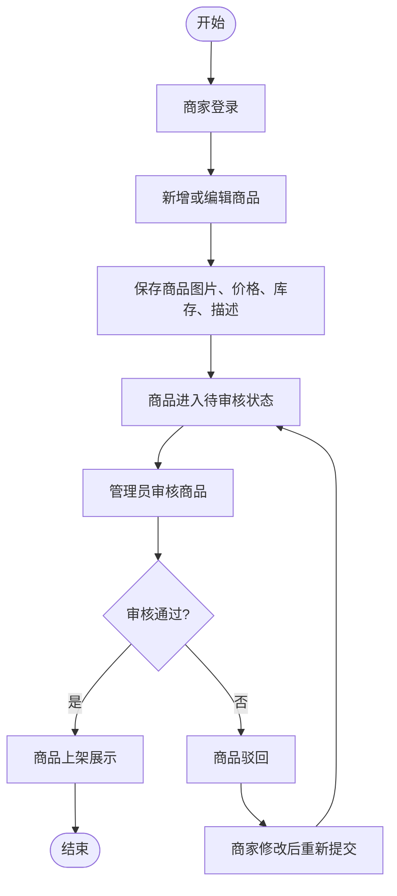

### 6.2 客户拼团购买流程

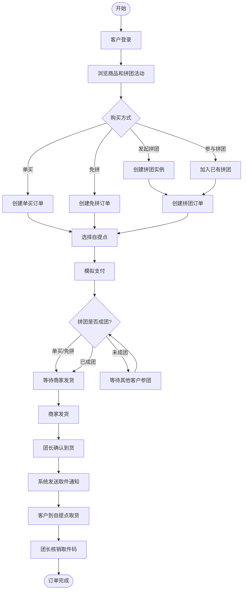

### 6.3 自提核销流程

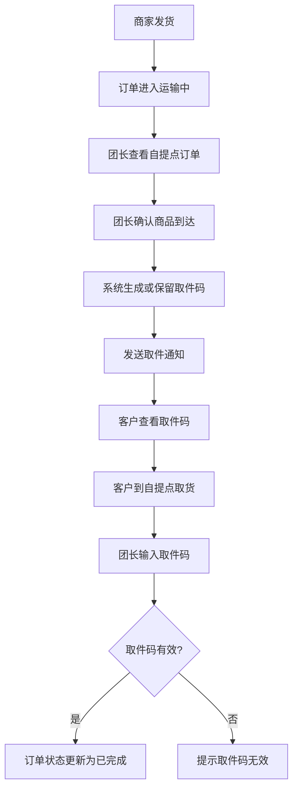

### 6.4 退款售后流程

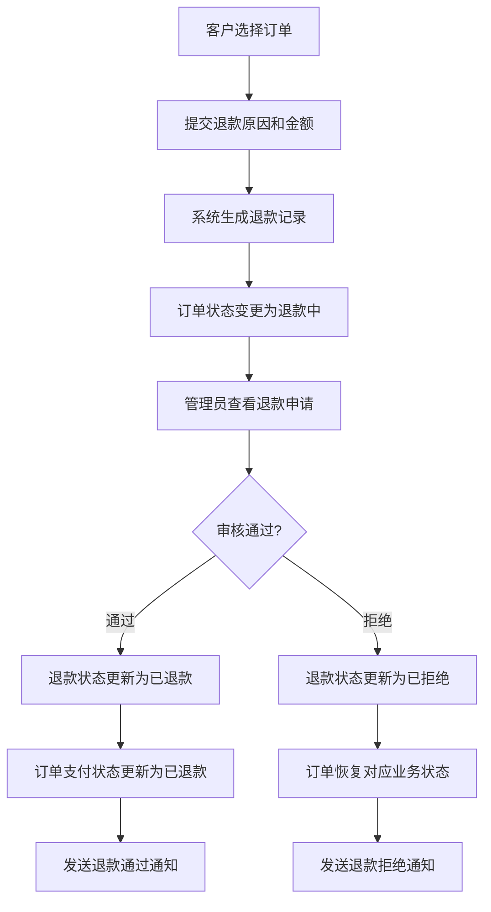

## 7. UML 分析与设计

### 7.1 用例图

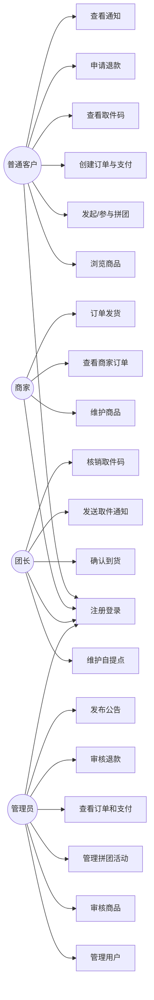

### 7.2 核心类图

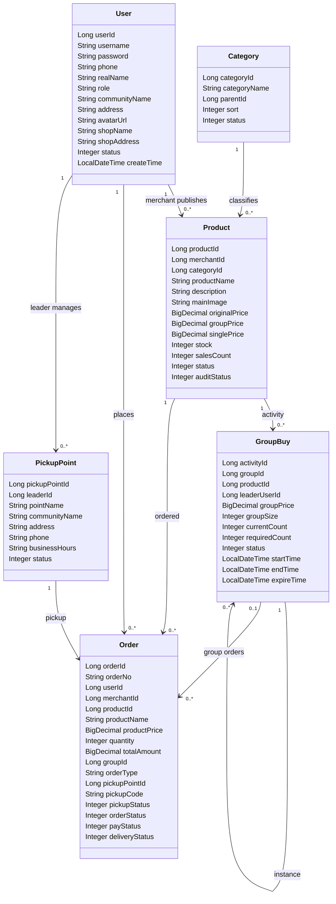

### 7.3 后端分层类关系图

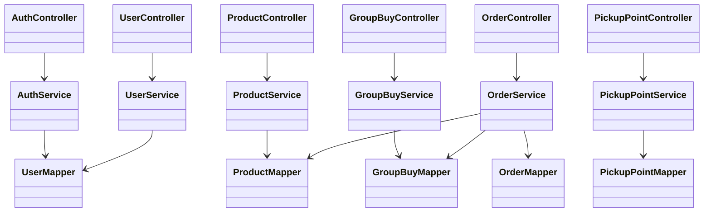

### 7.4 下单支付时序图

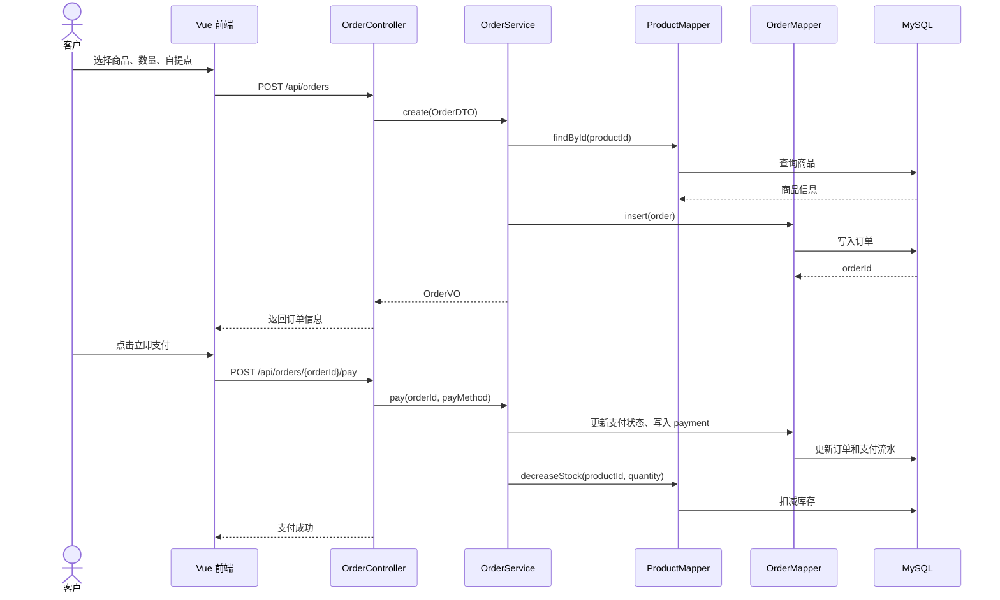

### 7.5 团长核销时序图

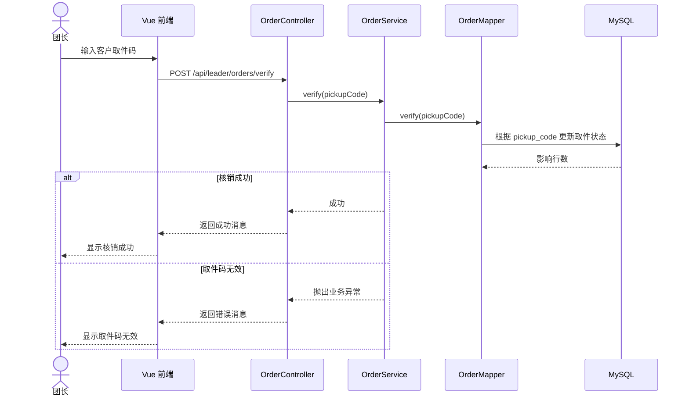

## 8. 数据库设计

### 8.1 数据库设计原则

系统采用精简型关系数据库设计，共 10 张核心表。设计时遵循以下原则：

- 角色不单独建表，通过 `user.role` 区分普通客户、商家、团长、管理员。
- 商家也是用户，通过 `user.shop_name`、`user.shop_address` 存储店铺信息。
- 订单默认对应一个商品，商品快照保存在 `orders` 表，便于课程设计实现。
- 拼团成员不单独建表，通过 `orders.group_id` 查询某个拼团下的成员订单。
- 取件码不单独建表，直接保存在 `orders.pickup_code`。
- 通知统一保存在 `notice`，可支持系统公告和定向通知。

### 8.2 ER 图

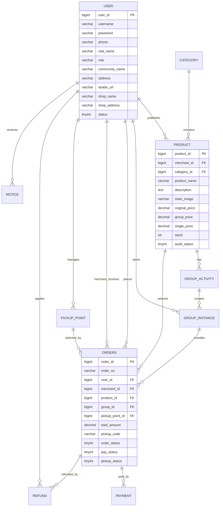

### 8.3 核心数据表说明

| 表名 | 中文含义 | 主要作用 |
|---|---|---|
| `user` | 用户表 | 统一存储客户、团长、商家、管理员账号和头像信息 |
| `category` | 商品分类表 | 存储商品分类 |
| `product` | 商品表 | 存储商品、图片、价格、库存、销量、审核状态和商家归属 |
| `group_activity` | 拼团活动表 | 存储拼团规则，如拼团价、成团人数、活动时间 |
| `group_instance` | 拼团实例表 | 存储用户发起的一次具体拼团 |
| `orders` | 订单表 | 存储订单、商品快照、拼团、自提、取件码、状态 |
| `payment` | 支付记录表 | 存储模拟支付流水 |
| `pickup_point` | 自提点表 | 存储团长管理的社区自提点 |
| `refund` | 退款售后表 | 存储退款申请和管理员处理结果 |
| `notice` | 通知表 | 存储系统公告、订单通知、取件通知、退款通知 |

### 8.4 关键状态字段

| 字段 | 所在表 | 说明 |
|---|---|---|
| `role` | `user` | USER、LEADER、MERCHANT、ADMIN |
| `audit_status` | `product` | 0 待审核，1 通过，2 驳回 |
| `status` | `product` | 0 下架，1 上架 |
| `order_status` | `orders` | 订单主状态，如待支付、拼团中、待发货、运输中、待自提、已完成、退款中 |
| `pay_status` | `orders/payment` | 0 未支付，1 已支付，3 已退款 |
| `delivery_status` | `orders` | 商家是否发货 |
| `pickup_status` | `orders` | 0 未到货，1 待取货，2 已取货 |
| `refund_status` | `refund` | 0 待审核，2 拒绝，3 已退款 |

## 9. 接口设计

### 9.1 接口风格

后端接口采用 REST 风格，统一以 `/api` 为前缀，响应结构使用 `Result<T>` 包装。

典型响应：

```json
{
  "code": 200,
  "message": "success",
  "data": {}
}
```

### 9.2 主要接口清单

| 模块 | 接口 | 方法 | 功能 |
|---|---|---|---|
| 认证 | `/api/auth/login` | POST | 用户登录 |
| 认证 | `/api/auth/register` | POST | 用户注册 |
| 健康检查 | `/api/health` | GET | 检查后端和数据库状态 |
| 用户 | `/api/users/{userId}` | GET/PUT | 查询或更新用户资料 |
| 管理员用户 | `/api/admin/users` | GET | 查询全部用户 |
| 管理员用户 | `/api/admin/users/{userId}/status` | PUT | 启用或禁用用户 |
| 商品 | `/api/categories` | GET | 查询分类 |
| 商品 | `/api/products` | GET | 查询商品列表 |
| 商品 | `/api/products/{id}` | GET | 查询商品详情 |
| 商家商品 | `/api/merchant/products` | POST | 新增商品 |
| 商家商品 | `/api/merchant/products/{id}` | PUT/DELETE | 修改或删除商品 |
| 管理员商品 | `/api/admin/products/{id}/audit` | POST | 审核商品 |
| 拼团 | `/api/group-activities` | GET | 查询拼团活动 |
| 拼团 | `/api/admin/group-activities` | POST | 创建拼团活动 |
| 拼团 | `/api/groups/start` | POST | 发起拼团 |
| 拼团 | `/api/groups/open` | GET | 查询可参与拼团 |
| 订单 | `/api/orders` | POST/GET | 创建或查询订单 |
| 订单 | `/api/orders/my` | GET | 查询我的订单 |
| 支付 | `/api/orders/{orderId}/pay` | POST | 模拟支付 |
| 商家订单 | `/api/merchant/orders` | GET | 查询商家订单 |
| 商家订单 | `/api/merchant/orders/{orderId}/deliver` | POST | 发货 |
| 团长订单 | `/api/leader/orders/wait-pickup` | GET | 查询自提点订单 |
| 团长订单 | `/api/leader/orders/{orderId}/send-code` | POST | 发送取件通知 |
| 团长订单 | `/api/leader/orders/verify` | POST | 核销取件码 |
| 退款 | `/api/refunds` | POST | 申请退款 |
| 退款 | `/api/admin/refunds` | GET | 查询退款申请 |
| 退款 | `/api/admin/refunds/{refundId}/handle` | POST | 处理退款 |
| 通知 | `/api/notices` | GET | 查询通知 |
| 通知 | `/api/admin/notices` | POST | 发布通知 |
| 支付流水 | `/api/admin/payments` | GET | 查询支付流水 |

## 10. 权限与安全设计

### 10.1 前端路由控制

前端路由通过 `meta.role` 标记页面角色，进入页面前检查 `localStorage` 中的 `token` 和 `role`。

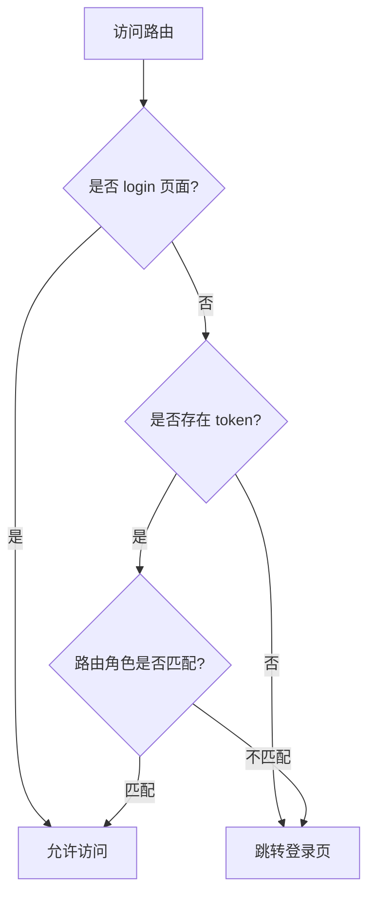

### 10.2 后端登录校验

登录时后端检查：

- 用户名是否存在。
- 密码是否正确。
- 用户选择的登录角色是否与数据库 `role` 一致。
- 用户账号是否被禁用。
- 成功后生成 token 并返回首页路径。

### 10.3 可继续增强的安全点

当前系统适合课程设计演示。后续可继续增强：

- 后端增加 JWT 拦截器，严格校验每个接口权限。
- 密码使用 BCrypt 加密存储。
- 管理员操作记录审计日志。
- 支付接口接入真实第三方支付前进行签名验证。
- 上传图片时增加文件类型和大小校验。

## 11. 系统落地实现说明

### 11.1 已实现的业务闭环

系统已经形成完整闭环：

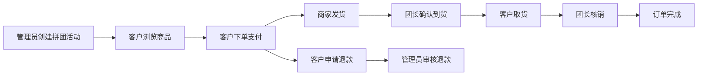

### 11.2 当前演示数据

系统数据库脚本中已内置：

- 管理员账号：`admin_1`。
- 团长账号：`leader_1`。
- 普通客户账号：`user_1`、`user_2`、`user_3`。
- 商家账号：`merchant_1`、`merchant_2`、`merchant_3`、`merchant_4`。
- 多个商品分类：新鲜果蔬、肉禽蛋奶、粮油副食、日用百货。
- 多个带图片、价格、库存的上架商品。
- 商品与商家明确对应。
- 拼团活动和社区自提点。

### 11.3 运行方式

后端启动：

```powershell
cd community-group-buy/backend/community-group-buy-backend
mvn spring-boot:run
```

前端启动：

```powershell
cd community-group-buy/frontend/community-group-buy-frontend
npm.cmd run dev -- --host 0.0.0.0
```

数据库导入：

```powershell
cmd /c "mysql -u root -p密码 --default-character-set=utf8mb4 < database\community_group_buy.session.sql"
```

构建验证：

```powershell
cd community-group-buy/backend/community-group-buy-backend
mvn test

cd community-group-buy/frontend/community-group-buy-frontend
npm.cmd run build
```

## 12. 系统特色与创新点

### 12.1 多角色统一入口

系统没有为每类角色单独设计登录页，而是通过统一登录入口和角色选择完成身份分流。这样既减少重复界面，也方便用户理解系统整体结构。

### 12.2 商品与商家明确绑定

每个商品通过 `merchant_id` 关联商家用户，并在前端展示商家名称和头像。商家登录后只能在自己的工作台中查看与自己相关的商品和订单。

### 12.3 拼团成员可视化

拼团信息不仅展示当前人数和成团人数，还展示团长和参与客户头像，使拼团状态更直观。

### 12.4 团长自提核销闭环

系统将商家发货、团长确认到货、生成取件码、客户取货、团长核销串联起来，符合社区团购“集中配送到点、自提核销”的履约方式。

### 12.5 精简数据库设计

系统使用 10 张核心表覆盖主要业务，避免课程设计中过度拆表导致实现难度增加，同时仍然保持清晰的数据关系。

## 13. 系统不足与后续展望

当前系统已经满足课程设计和基础演示要求，但仍可继续扩展：

- 增加真实图片上传功能，替代手工填写图片 URL。
- 增加分页、排序和复杂搜索。
- 增加图表统计，如每日交易额、热门商品排行、商家销售排行。
- 增加后端 JWT 拦截器和接口级权限控制。
- 增加订单自动取消、拼团失败自动退款等定时任务。
- 增加操作日志表，记录管理员审核、商家发货、团长核销等关键行为。
- 增加移动端适配和扫码核销功能。
- 增加真实支付接口和支付回调处理。

## 14. 总结

社区团购管理信息系统以社区居民购物和自提履约为核心，构建了客户、商家、团长、管理员四类角色协同工作的业务平台。系统从登录注册、商品管理、拼团活动、订单支付、商家发货、团长核销、退款售后到通知公告形成了较完整的业务闭环。

在技术实现上，系统采用 Vue 3、Vite、Element Plus、Axios 构建前端界面，采用 Spring Boot、MyBatis、MySQL 构建后端服务与数据持久化层。整体架构清晰，模块职责明确，数据库设计精简但覆盖核心业务，适合作为信息系统分析与设计课程设计项目，也具备继续扩展为更完整社区团购平台的基础。
